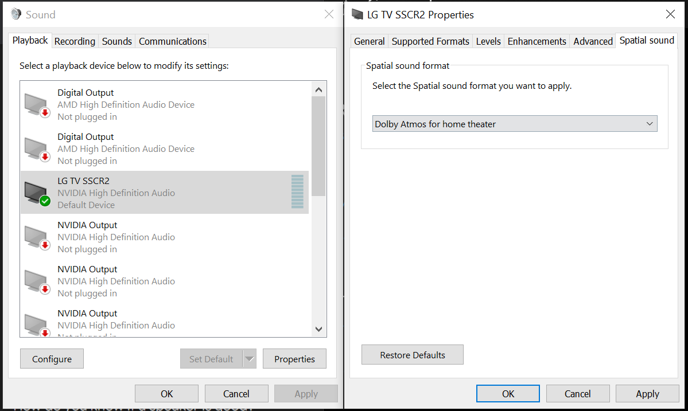
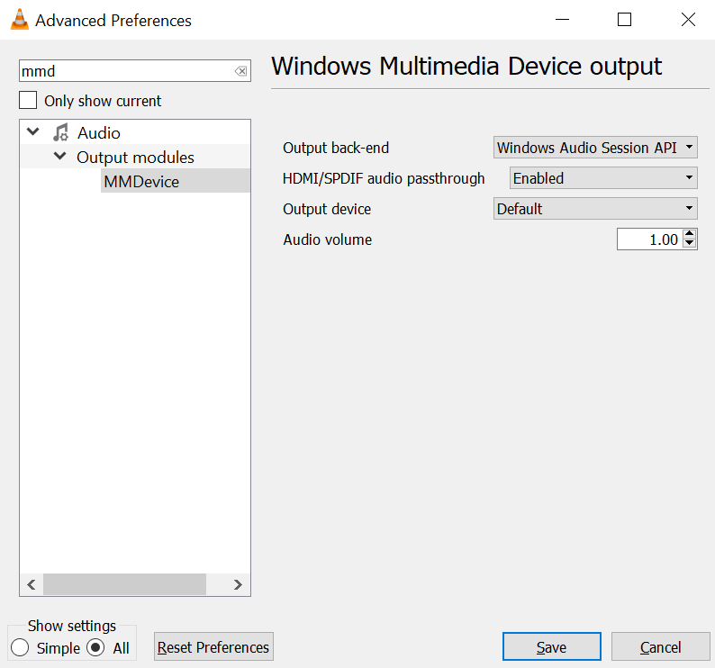

Table of Contents
=================

* [Table of Contents](#table-of-contents)
* [System Health](#system-health)
* [Installs](#installs)
   * [WSL](#wsl)
      * [Error](#error)
      * [Install](#install)
      * [Cleanup](#cleanup)
* [Issues](#issues)
   * [Window not blanking](#window-not-blanking)
   * [Webcam](#webcam)
      * [Reset Camera](#reset-camera)
      * [Check Privacy Settings for Camera](#check-privacy-settings-for-camera)
* [Sound](#sound)
   * [Dolby ATMOS](#dolby-atmos)
      * [Setup](#setup)
      * [VLC](#vlc)
* [Config](#config)
   * [Disable web search in startmenu](#disable-web-search-in-startmenu)


# System Health

run both these commands one after the other in cmd as administrator

System File Checker
```
SFC /scannow
```

Repair Windows Image
```
DISM /online /cleanup-image /restorehealth
```

# Installs

For stuff that should be simple but isnt (typical windows BS)

## WSL

ref 1: https://learn.microsoft.com/en-us/answers/questions/1152199/wslregisterdistribution-failed-with-error-0x800701

ref 2: https://blog.csdn.net/m0_54917022/article/details/128620422

### Error

```
Installing, this may take a few minutes...
WslRegisterDistribution failed with error: 0x8007019e
Error: 0x8007019e The Windows Subsystem for Linux has not been enabled.

Press any key to continue...
```

### Install

Install using windows store:

Ubuntu 24.04 (or whatever is the latest)
Terminal

run following cmds in cmd.exe as administrator:

```
wsl --install

dism.exe /online /enable-feature /featurename:Microsoft-Windows-Subsystem-Linux /all /norestart

dism.exe /online /enable-feature /featurename:VirtualMachinePlatform /all /norestart

wsl --set-default-version 2

echo done
```

### Cleanup

I end up with two ubuntu, I only want the latest.

List Installed distros:


```
wsl --list --verbose
```

<pre>
  NAME            STATE           VERSION
* Ubuntu          Stopped         2
  Ubuntu-24.04    Running         2
</pre>

to remove the default ubuntu install

```
wsl --unregister Ubuntu
```

Then we need to remove it as an option in Terminal, else it auto installs when you click it (annoying as).

In terminal, go to settings, scroll down to profiles, select "Ubuntu" and either delete profile (right at the bottom) or "Hide profile from dropdown".

# Issues

## Window not blanking

assuming you have screen blanking enabled, check whats holding it open

```
powercfg -requests
```

### USO Worker

see also: https://superuser.com/questions/1612777/is-there-any-fix-for-mousocoreworker-exe-preventing-windows-10-entering-sleep

Microsoft has a long running bug where windows update (even when just waiting to install) keeps screen on.

for me this is the culprit

```
PS C:\Windows\system32> powercfg -requests
DISPLAY:
None.

SYSTEM:
None.

AWAYMODE:
None.

EXECUTION:
[PROCESS] \Device\HarddiskVolume3\Windows\System32\MoUsoCoreWorker.exe
USO Worker

PERFBOOST:
None.

ACTIVELOCKSCREEN:
None.
```

and Ive tried this fix.

```
powercfg /requestsoverride process "MoUSO Core Worker" execution
powercfg /requestsoverride process "USO Worker" execution
```

This will override any requests MoUSO/ USO makes which you can confirm with this command

```
powercfg /requestsoverride
```

when you run powercfg -requests, those entries may still appear, but they are ignored by power management logic.

## Webcam

Camera is being blocked or used by another program

ref: https://answers.microsoft.com/en-us/windows/forum/all/camera-is-being-blocked-or-used-by-another/db5e5b21-ad10-434e-a8f1-6bb06dd7fe3e

### Reset Camera

- Press **Windows key + X**
- Click **Settings**
- Click **Apps**
- Click **Apps and Features**
- In Search enter **camera**
- Click the camera app in the search results (must click to show advance options)
- Click **Advanced Options**
- Scroll to bottom, click **Reset**

### Check Privacy Settings for Camera

- Press **Windows key + X**
- Click **Settings**
- Click **Privacy**
- Click **Camera**
- Click **Camera access for this device** and ensure it is **ON**
- Ensure **Allow apps to access your camera** is set
- Scroll down and review the section **Choose which Microsoft Store apps can access your camera** (ensure teams is ON)
- Ensure **Allow desktop apps to access your camera** is on (for non microsoft store apps apps such as firefox)


# Sound

## Dolby ATMOS

ref 1: https://www.reddit.com/r/VLC/comments/dwzy9p/how_to_fix_dolby_atmos_in_vlc/?share_id=1yYKBsJNbBlHwkde5PVud&utm_content=1&utm_medium=android_app&utm_name=androidcss&utm_source=share&utm_term=5

Test Video: https://youtu.be/ce8XUUflWhA?si=memwiki

Its a two part solution, first you need to set output to dolby atmos and install dolby atmos via the windows store.

### Setup

Sound Properties, Spatial Sound, Select Dolby Atmos (windows store will pop up asking to install, do so)



### VLC

Go to Preferences > All > Audio > Output modules

Change "Audio output module" to "Windows Multimedia Device output"

Go to the "MMDevice" settings

Change the "Output back-end" to "Windows Audio Session API output"

Set "HDMI/SPDIF audio passthrough" to "Enabled"



# Config

## Disable web search in startmenu

ref: https://www.tomshardware.com/how-to/disable-windows-web-search

yet another feature from microsoft NO ON FUCKING ASKED FOR

Run the [reg file](regfixes/DisableSearchBoxSuggestions.reg) and reboot (or manually enter it)
